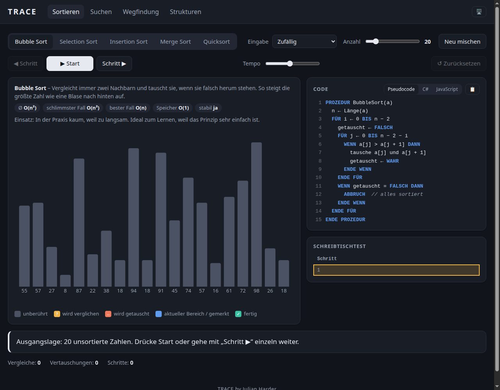
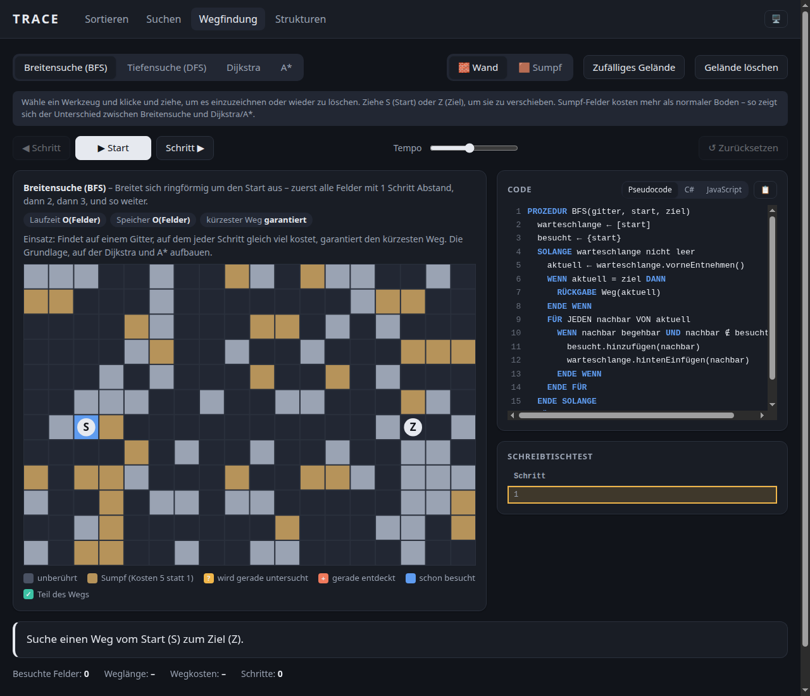
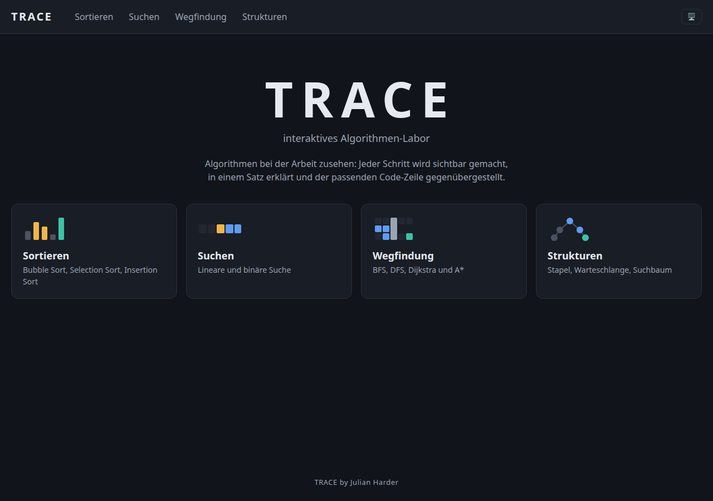
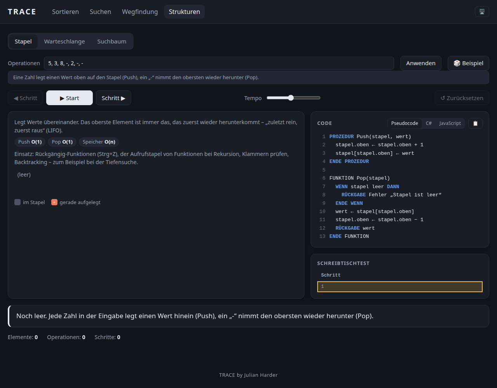

# TRACE – interaktives Algorithmen-Labor

**TRACE by Julian Harder**

Eine interaktive Webseite, auf der man Algorithmen bei der Arbeit zusieht: Sortieren, Suchen, Wegfindung und Datenstrukturen. Jeder Schritt wird sichtbar gemacht, in einem Satz erklärt und der passenden Code-Zeile gegenübergestellt – dazu läuft parallel ein klassischer Schreibtischtest mit.

Entstanden als Übungsprojekt zur Prüfungsvorbereitung (Fachinformatiker Anwendungsentwicklung, Schwerpunkt Sortieren/Suchen/Pseudocode/Schreibtischtest) und fürs Portfolio – umgesetzt mit Unterstützung von Claude Code.

## Screenshots

| Sortieren | Wegfindung |
|---|---|
|  |  |

| Startseite | Datenstrukturen |
|---|---|
|  |  |

## Was TRACE kann

| Bereich | Algorithmen | Besonderheiten |
|---|---|---|
| **Sortieren** | Bubble Sort, Selection Sort, Insertion Sort, Merge Sort, Quicksort | Eingabe-Varianten (zufällig, sortiert, umgekehrt, fast sortiert, viele gleiche Werte), eigene Zahlen, Zähler für Vergleiche/Vertauschungen |
| **Suchen** | Lineare Suche, Binäre Suche | Zeigt live, warum binäre Suche nur bei sortierten Daten funktioniert |
| **Wegfindung** | Breitensuche (BFS), Tiefensuche (DFS), Dijkstra, A* | Wände und Sumpf (teureres Gelände) per Maus/Finger zeichnen, Start/Ziel verschieben – zeigt live, warum Dijkstra/A* bei unterschiedlichen Kosten einen günstigeren Weg finden als die ungewichtete Breitensuche |
| **Datenstrukturen** | Stapel (LIFO), Warteschlange (FIFO), binärer Suchbaum | Eigene Operationsfolgen eingeben oder per „🎲 Beispiel“-Knopf ausprobieren |

Jeder Algorithmus bringt mit:
- **Code-Ansicht** mit markierter aktueller Zeile, umschaltbar zwischen Pseudocode (IHK-Stil), C# und JavaScript, plus Kopieren-Knopf
- **Schreibtischtest-Tabelle**, die Variablenwerte Schritt für Schritt mitschreibt
- **Infokasten** mit Laufzeit (Ø, bester/schlimmster Fall), Speicherbedarf und Einsatzgebiet
- **Start/Pause, Tempo-Regler, Schritt vor/zurück** – dieselbe Bedienung in jedem Bereich

## Starten

`index.html` per Doppelklick öffnen. Es wird kein Server und keine Installation gebraucht.

Wer es online sehen will, ohne die Datei herunterzuladen: **[Live-Demo auf GitHub Pages]()** *(Link nach der Veröffentlichung hier eintragen)*

## Bedienung

| Taste | Funktion |
|---|---|
| Leertaste | Start / Pause |
| Pfeil rechts / links | Schritt vor / zurück |
| R | neue Zufallszahlen / neues Gitter |

Der Knopf oben rechts im Kopfbereich (🖥️ / ☀️ / 🌙) schaltet zwischen System-, hellem und dunklem Farbschema um – die Wahl wird im Browser gemerkt und beim nächsten Besuch wieder angewendet.

## Einheitlicher Farbcode

Damit man sich in jedem Bereich sofort zurechtfindet, bedeutet dieselbe Farbe überall dasselbe:

| Farbe | Bedeutung |
|---|---|
| Grau | unberührt |
| Gelb/Bernstein | wird gerade verglichen oder geprüft |
| Orange/Koralle | wird gerade verändert (getauscht, verschoben, eingefügt) |
| Blau | aktueller Suchbereich / schon besucht |
| Grün/Türkis | fertig bzw. gefunden |

Farbe ist nie das einzige Merkmal – zusätzlich gibt es Symbole (`?`, `↔`, `✓`) und Text, damit es auch bei Farbschwäche verständlich bleibt.

## Technische Entscheidungen

Ein paar Rahmenbedingungen standen von Anfang an fest und ziehen sich durchs ganze Projekt:

- **Mehrere Dateien statt einer großen Datei** – siehe Ordnerstruktur unten, jeder Algorithmus bekommt seine eigene, kleine Datei
- **Offline lauffähig ohne Server** – deshalb normale `<script>`-Tags statt ES-Module (Module funktionieren beim Öffnen per Doppelklick nicht zuverlässig)
- **Keine externen Bibliotheken** – reines HTML, CSS und JavaScript, gezeichnet mit Canvas
- **Kein Ton**

## Aufbau

Logik und Darstellung sind strikt getrennt – das ist der wichtigste Baustein des Projekts:

- Jeder Algorithmus ist eine **Generator-Funktion** (`function*`). Er verändert die Daten, zeichnet aber selbst nichts, sondern beschreibt mit `yield` jeden einzelnen Schritt als Objekt: Typ (`vergleich`, `tausch`, `entdecken`, …), betroffene Elemente, Code-Zeile, Variablen für den Schreibtischtest, Erklärungstext.
- Der **Player** (`js/player.js`) holt sich die Schritte aus dem Generator, merkt sie sich alle in einer Liste (damit „Schritt zurück“ funktioniert, ohne neu zu berechnen) und steuert Start, Pause, Tempo und Navigation.
- Die **Ansichten** (`js/sortieren/ansicht.js`, `js/suchen/ansicht.js`, `js/wegfindung/gitter.js`, `js/strukturen/*ansicht.js`) zeichnen nur, was im aktuellen Schritt-Objekt steht – sie kennen den Algorithmus selbst nicht.
- Ein **Schritt-Objekt** sieht beispielhaft so aus:

  ```js
  {
    typ: "vergleich",           // oder "tausch", "fertig", "besucht" …
    indizes: [3, 4],            // welche Elemente betroffen sind
    zeile: "vergleich",         // welche Code-Zeile gerade läuft (siehe @@marken im Code)
    variablen: { i: 2, j: 3 },  // für den Schreibtischtest
    text: "Vergleiche 8 und 3"  // Erklärung für den Nutzer
  }
  ```

### Ordnerstruktur

```
trace/
├── index.html
├── css/
│   └── style.css
├── js/
│   ├── main.js              Start, Navigation zwischen den Bereichen (Hash-Routing)
│   ├── player.js             Start/Pause, Tempo, Schritt vor/zurück
│   ├── ui/
│   │   ├── theme.js          Hell/Dunkel/System-Umschalter
│   │   ├── codeansicht.js    Code mit markierter Zeile, Kopieren-Knopf
│   │   └── schreibtisch.js   Schreibtischtest-Tabelle
│   ├── sortieren/
│   │   ├── ansicht.js        Balken zeichnen
│   │   ├── bereich.js        Verbindet Algorithmen, Player und Ansicht
│   │   ├── bubble.js, selection.js, insertion.js, merge.js, quick.js
│   ├── suchen/
│   │   ├── ansicht.js, bereich.js, linear.js, binaer.js
│   ├── wegfindung/
│   │   ├── gitter.js         Gitter zeichnen und mit Maus/Finger bearbeiten
│   │   ├── bereich.js        u. a. die gemeinsame Prioritätswarteschlange
│   │   └── bfs.js, dfs.js, dijkstra.js, astar.js
│   └── strukturen/
│       ├── kette.js          Gemeinsame Technik für Stapel und Warteschlange
│       ├── stapel.js, warteschlange.js  (nur Beschriftung/Code-Text)
│       ├── baumansicht.js, suchbaum.js
│       └── bereich.js        Schaltet zwischen den drei Unterbereichen um
└── screenshots/
```


